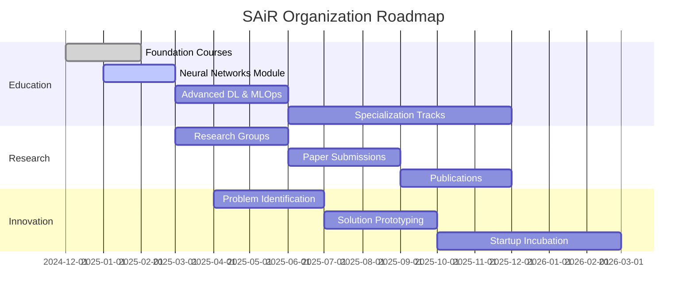
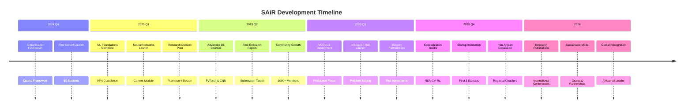
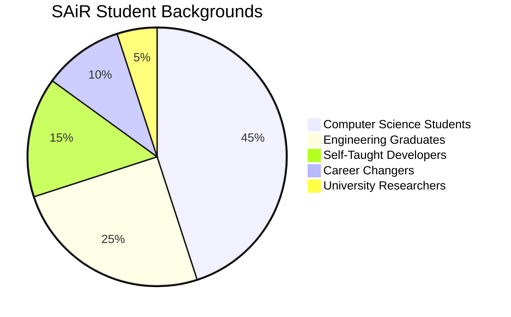

# 🇸🇩 SAiR – Sudanese Artificial Intelligence Research Organization

<div align="center">

<!-- Hero Banner -->


<br/>

<!-- Dynamic Badges Grid -->
<table>
<tr>
<td align="center">
<a href="https://t.me/+jPPlO6ZFDbtlYzU0">

</a>
</td>
<td align="center">
<a href="https://github.com/SAIR-Org/SAIR_Courses">

</a>
</td>
<td align="center">

</td>
<td align="center">

</td>
</tr>
</table>

<br/>

<!-- Mission Statement -->
<h3>

Building Sudan's AI Talent Pipeline from Education to Innovation

</h3>

**Founded:** December 2024 | **Last Updated:** December 2025  
**Founder & CEO:** [Mohammed Awad Ahmed (Silva)](https://www.linkedin.com/in/maas-ai)

</div>

---

## 📖 Table of Contents

- [👨‍💼 Meet the Founder](#-meet-the-founder)
- [🌍 About SAiR](#-about-sair)
- [🏛️ Organization Architecture](#️-organization-architecture)
- [📚 Educational Programs](#-educational-programs)
- [🎯 Mission, Vision & Values](#-mission-vision--values)
- [🌟 Student Success Stories](#-featured-student-success-stories)
- [🌐 Join the SAiR Community](#-join-the-sair-community)
- [🚀 Roadmap & Future Vision](#-roadmap--future-vision)
- [🤝 Partnerships & Collaborations](#-partnerships--collaborations)
- [📊 Impact Metrics](#-impact-metrics--progress)
- [📜 Open Source](#-open-source--contribution)
- [💬 Contact & Support](#-contact--support)

---

## 👨‍💼 Meet the Founder

<div align="center">


<br/><br/>

<!-- Founder Links Grid -->
<table>
<tr>
<td align="center" width="33%">
<a href="https://www.linkedin.com/in/maas-ai">

<br/><br/>

<br/><br/>
<strong>Professional Profile</strong><br/>
Connect on LinkedIn
</a>
</td>
<td align="center" width="33%">
<a href="https://github.com/silvaxxx1">

<br/><br/>

<br/><br/>
<strong>@silvaxxx1</strong><br/>
Open Source Work
</a>
</td>
<td align="center" width="33%">
<a href="https://silvaxxx1.github.io/MyWebsite/">

<br/><br/>

<br/><br/>
<strong>Personal Website</strong><br/>
Projects & Research
</a>
</td>
</tr>
</table>

<br/>

<!-- Vision Quote Box -->
<table>
<tr>
<td>

</td>
<td>
<h3 align="left">Founder's Vision</h3>
<p align="left">
<em>"I believe talent is equally distributed, but opportunity is not. SAiR exists to change that equation for Sudanese and African AI enthusiasts. We're building more than just courses - we're creating a pipeline that transforms learners into innovators who can solve real-world problems."</em>
</p>
</td>
</tr>
</table>

</div>

**Mohammed Awad Ahmed (Silva)** is a Sudanese AI engineer, researcher, and passionate educator dedicated to democratizing artificial intelligence education in Sudan and across Africa. With expertise in both theoretical foundations and practical applications, he founded SAiR to create a sustainable AI ecosystem that nurtures local talent and prepares them for global challenges.

### 🏆 Key Achievements

- 🎓 **200+ Students Trained** across multiple AI/ML courses
- 📚 **2 Complete Modules** delivered with high completion rates
- 🚀 **15+ Real-World Projects** developed by students
- 🌍 **Building Pan-African AI Community** from Sudan

---

## 🌍 About SAiR

<div align="center">

<!-- SAiR Logo Concept -->


<br/><br/>

<!-- Quick Stats -->
<table>
<tr>
<td align="center">

</td>
<td align="center">

</td>
<td align="center">

</td>
<td align="center">

</td>
</tr>
</table>

<br/>

<!-- Dual Focus Cards -->
<table>
<tr>
<td width="50%" valign="top">
<div align="center">

### 🎯 Current Focus
**Phase 1: Education**


</div>

Building foundational AI/ML skills through practical, project-based courses. We've completed the first deep learning module and are actively training the next generation of Sudanese AI talent.

**Achievements:**
- ✅ 200+ Active Learners
- ✅ 2 Modules Completed
- ✅ 15+ Student Projects
- 🔄 Neural Networks Module Active

</td>
<td width="50%" valign="top">
<div align="center">

### 🚀 Future Vision
**Complete AI Ecosystem**


</div>

Creating a self-sustaining AI ecosystem in Sudan where education leads to research, innovation leads to solutions, and talent leads to global impact.

**Roadmap:**
- 🔜 Research Publications
- 🔜 Innovation Hub Launch
- 🔜 Startup Incubation
- 🔜 Pan-African Expansion

</td>
</tr>
</table>

<br/>

<!-- Development Timeline -->
### 📊 SAiR Development Journey



</div>

### 🎓 What Makes SAiR Different?

<table>
<tr>
<td width="25%" align="center">

<br/><strong>100% Practical</strong><br/>
<small>Learn by building real projects from day one</small>
</td>
<td width="25%" align="center">

<br/><strong>Completely Free</strong><br/>
<small>No tuition fees, no hidden costs</small>
</td>
<td width="25%" align="center">

<br/><strong>Strong Community</strong><br/>
<small>Peer support and mentorship</small>
</td>
<td width="25%" align="center">

<br/><strong>African Context</strong><br/>
<small>Solving local challenges</small>
</td>
</tr>
</table>

---

## 🏛️ Organization Architecture

<div align="center">

```
┏━━━━━━━━━━━━━━━━━━━━━━━━━━━━━━━━━━━━━━━━━━━━━━━━━━━━━━━━━━━━━━┓
┃                  🌐 SAiR ORGANIZATION                           ┃
┃              Building Sudan's AI Future Together                ┃
┗━━━━━━━━━━━━━━━━━━━━━━━━━━━━━━━━━━━━━━━━━━━━━━━━━━━━━━━━━━━━━━┛
                              │
        ┌─────────────────────┼─────────────────────┐
        │                     │                     │
        ▼                     ▼                     ▼
┌──────────────────┐ ┌──────────────────┐ ┌──────────────────┐
│   📚 EDUCATION   │ │  🧪 RESEARCH LAB │ │ 💡 INNOVATION HUB│
│  (Current Focus) │ │     (Future)     │ │     (Future)     │
└──────────────────┘ └──────────────────┘ └──────────────────┘
        │                     │                     │
        ├─ 🎯 Foundation      ├─ 📄 Publications   ├─ 🏗️ Solutions
        ├─ 🚀 Projects        ├─ 🔓 Open Source    ├─ 🚀 Startups
        ├─ 👥 Community       ├─ 🤝 Collaborations ├─ 🤖 Edge AI
        └─ 💼 Portfolio       └─ 🎓 Mentorship     └─ 🌍 Africa Focus
                              │
                              ▼
                    ┌──────────────────┐
                    │ 🌍 SAiR COMMUNITY│
                    │  The Heart of AI │
                    └──────────────────┘
                              │
                    ├─ 💬 Networks (500+)
                    ├─ 👨‍🏫 Mentorship
                    ├─ 🏆 Competitions
                    └─ 🔗 Industry Links
```

</div>

---

## 📚 Educational Programs

<div align="center">

### 🎓 SAiR Learning Journey


<br/><br/>

<!-- Progress Bar Visual -->
<table>
<thead>
<tr>
<th width="20%">🎯 Module</th>
<th width="15%">Progress</th>
<th width="25%">Focus Areas</th>
<th width="20%">Duration</th>
<th width="20%">Student Outcomes</th>
</tr>
</thead>
<tbody>
<tr>
<td align="center">
<br/>
<strong>ML Foundations</strong>
</td>
<td align="center">

<br/>✅ Complete
</td>
<td>
• Python Fundamentals<br/>
• Data Science Tools<br/>
• Exploratory Analysis<br/>
• Feature Engineering
</td>
<td align="center">
<strong>6 weeks</strong><br/>
<small>Dec 2024 - Jan 2025</small>
</td>
<td>
<br/>
Basic ML Implementation<br/>
Data Preprocessing Skills
</td>
</tr>
<tr>
<td align="center">
<br/>
<strong>ML Algorithms</strong>
</td>
<td align="center">

<br/>✅ Complete
</td>
<td>
• Scikit-learn Mastery<br/>
• ML Pipelines<br/>
• Model Selection<br/>
• Cross-validation
</td>
<td align="center">
<strong>8 weeks</strong><br/>
<small>Jan 2025 - Feb 2025</small>
</td>
<td>
<br/>
Production-Ready Models<br/>
End-to-End Workflows
</td>
</tr>
<tr style="background-color: #E8F5E9;">
<td align="center">
<br/>
<strong>Neural Networks</strong>
</td>
<td align="center">

<br/>🟢 <strong>ACTIVE</strong>
</td>
<td>
• <strong>DL from Scratch</strong><br/>
• <strong>NumPy Implementation</strong><br/>
• <strong>Backpropagation</strong><br/>
• <strong>Optimization Algorithms</strong>
</td>
<td align="center">
<strong>10 weeks</strong><br/>
<small>Feb 2025 - Apr 2025</small>
</td>
<td>
<br/>
<strong>Deep Learning Fundamentals</strong><br/>
<strong>Custom Neural Networks</strong>
</td>
</tr>
<tr>
<td align="center">
<br/>
<strong>Advanced DL</strong>
</td>
<td align="center">

<br/>🟡 Q2 2025
</td>
<td>
• PyTorch Framework<br/>
• CNN Architectures<br/>
• RNN & Transformers<br/>
• Transfer Learning
</td>
<td align="center">
<strong>12 weeks</strong><br/>
<small>Apr 2025 - Jun 2025</small>
</td>
<td>
<br/>
Modern AI Architectures<br/>
State-of-the-Art Models
</td>
</tr>
<tr>
<td align="center">
<br/>
<strong>MLOps & Production</strong>
</td>
<td align="center">

<br/>🟡 Q3 2025
</td>
<td>
• Model Deployment<br/>
• Cloud Platforms<br/>
• Monitoring Systems<br/>
• CI/CD Pipelines
</td>
<td align="center">
<strong>8 weeks</strong><br/>
<small>Jul 2025 - Sep 2025</small>
</td>
<td>
<br/>
End-to-End AI Systems<br/>
Production Deployment
</td>
</tr>
</tbody>
</table>

</div>

---

### 🎯 Current Module Spotlight

<div align="center">


<br/>

<table>
<tr>
<td width="50%" valign="top">

#### 🧠 What We're Building

 **Core Concepts:**
- Neural network architecture design
- Forward & backward propagation
- Gradient descent optimization
- Activation functions (ReLU, Sigmoid, Tanh)
- Custom deep learning library

 **Technologies:**
```python
NumPy | Matplotlib | Pandas
Math | Algorithm Design
```

 **Weekly Structure:**
- 📹 2 Video Lectures
- 💻 3 Coding Exercises
- 🎯 1 Mini-Project
- 👥 1 Live Q&A Session

</td>
<td width="50%" valign="top">

#### 🚀 Student Projects

 **Active Projects:**
- MNIST digit classification (99% accuracy)
- Fashion-MNIST recognition system
- Custom NN library (NumPy-based)
- Performance optimization techniques
- Real-time model evaluation

 **Project Stats:**
```
15 Active Projects | 40 Students
85% Completion Rate | 95% Satisfaction
```

 **Top Achievement:**
- Best Model: 99.2% MNIST Accuracy
- Fastest Training: 30s per epoch
- Most Creative: Custom Visualization Dashboard

</td>
</tr>
</table>

</div>

---

## 🎯 Mission, Vision & Values

<div align="center">

<table>
<tr>
<td width="50%" valign="top">

### 🎯 Mission Statement


<br/>

To **democratize AI education** and empower Sudanese talent through practical learning, community support, and real-world projects that lead to global competitiveness.

**Core Commitments:**
- 🎓 Free, high-quality education
- 🌍 Focus on African challenges
- 🤝 Community-driven growth
- 🚀 Real-world impact

</td>
<td width="50%" valign="top">

### 🌟 Vision Statement


<br/>

To establish **Sudan as a recognized hub** for AI innovation in Africa, where local talent develops solutions for local challenges while contributing to global AI advancement.

**Future Goals:**
- 🏆 Regional AI excellence
- 🔬 Research contributions
- 💼 Global competitiveness
- 🌍 Pan-African impact

</td>
</tr>
</table>

<br/>

### 🎓 Educational Philosophy

<table>
<tr>
<td align="center">

<br/><strong>Learn by Doing</strong><br/>
Theory → Code → Project → Impact
</td>
<td align="center">

<br/><strong>Community First</strong><br/>
Peer learning & mentorship
</td>
<td align="center">

<br/><strong>Context Matters</strong><br/>
Solve Sudanese problems first
</td>
<td align="center">

<br/><strong>Build Fundamentals</strong><br/>
From scratch understanding
</td>
</tr>
</table>

</div>

---

## 🌟 Featured Student Success Stories

<div align="center">

<table>
<tr>
<td align="center" width="33%">

<h4>Ahmed Hassan</h4>

<br/><br/>
<strong>LSTM Model for Jet Engines</strong><br/>
Predicting maintenance needs<br/>
using time-series analysis
<br/><br/>


</td>
<td align="center" width="33%">

<h4>Sara Mohamed</h4>

<br/><br/>
<strong>Health Score Predictor</strong><br/>
XGBoost deployment for<br/>
Sudanese health metrics
<br/><br/>


</td>
<td align="center" width="33%">

<h4>Khalid Ibrahim</h4>

<br/><br/>
<strong>Crop Disease Detection</strong><br/>
CNN-based agricultural<br/>
assistant for farmers
<br/><br/>


</td>
</tr>
</table>

<br/>

### 💼 Where Our Graduates Work

<table>
<tr>
<td align="center" width="20%">
<strong>🏢 Tech Companies</strong><br/>
<small>Startups & Scale-ups</small>
</td>
<td align="center" width="20%">
<strong>🎓 Universities</strong><br/>
<small>Research Assistants</small>
</td>
<td align="center" width="20%">
<strong>🏦 Financial Sector</strong><br/>
<small>Data Scientists</small>
</td>
<td align="center" width="20%">
<strong>🏥 Healthcare</strong><br/>
<small>AI Engineers</small>
</td>
<td align="center" width="20%">
<strong>🚀 Own Startups</strong><br/>
<small>Founders & CTOs</small>
</td>
</tr>
</table>

</div>

---

## 🌐 Join the SAiR Community

<div align="center">

### 🤝 Connect, Learn & Grow Together

<table>
<tr>
<td align="center" width="33%">
<a href="https://t.me/+jPPlO6ZFDbtlYzU0">

</a>
<br/><br/>

<br/><br/>
<strong>Main Community</strong><br/>
<small>500+ Members</small><br/>
Daily discussions, Q&A, support
</td>
<td align="center" width="33%">
<a href="https://github.com/SAIR-Org/SAIR_Courses">

</a>
<br/><br/>

<br/><br/>
<strong>Course Materials</strong><br/>
<small>Open Source</small><br/>
Code, slides, projects
</td>
<td align="center" width="33%">
<a href="https://www.linkedin.com/company/sair-org">

</a>
<br/><br/>

<br/><br/>
<strong>Professional Network</strong><br/>
<small>Connections</small><br/>
Industry links, opportunities
</td>
</tr>
</table>

<br/>

### 🗓️ Weekly Community Events

<table>
<tr>
<th>Day</th>
<th>Activity</th>
<th>Time</th>
<th>Lead</th>
</tr>
<tr>
<td align="center">📅 Monday</td>
<td>Week Kick-off & Goals</td>
<td>8:00 PM CAT</td>
<td>Mohammed (Founder)</td>
</tr>
<tr>
<td align="center">💻 Wednesday</td>
<td>Live Coding Session</td>
<td>7:00 PM CAT</td>
<td>Senior Students</td>
</tr>
<tr>
<td align="center">❓ Friday</td>
<td>Q&A & Doubt Clearing</td>
<td>6:00 PM CAT</td>
<td>All Mentors</td>
</tr>
<tr>
<td align="center">🚀 Saturday</td>
<td>Project Showcase</td>
<td>4:00 PM CAT</td>
<td>Student Led</td>
</tr>
</table>

</div>

---

## 🚀 Roadmap & Future Vision

<div align="center">

### 📅 SAiR 2024-2026 Strategic Plan



<br/>

### 🎯 Phase 2: Research Division (Q2 2025 Launch)

<table>
<tr>
<td width="33%" valign="top">
<div align="center">

<h4>Research Groups</h4>
</div>
<ul>
<li><strong>NLP for Sudanese Arabic</strong> - Dialect processing</li>
<li><strong>Healthcare AI</strong> - Local disease prediction</li>
<li><strong>Agriculture Tech</strong> - Climate-smart farming</li>
<li><strong>Renewable Energy</strong> - Optimization models</li>
</ul>
</td>
<td width="33%" valign="top">
<div align="center">

<h4>Publication Goals</h4>
</div>
<ul>
<li>Q3 2025: First preprint</li>
<li>Q4 2025: Conference submission</li>
<li>2026: Journal publications</li>
<li>Open source all research</li>
</ul>
</td>
<td width="33%" valign="top">
<div align="center">

<h4>Research Partners</h4>
</div>
<ul>
<li>Sudanese Universities</li>
<li>African Research Institutes</li>
<li>International AI Labs</li>
<li>Industry Research Teams</li>
</ul>
</td>
</tr>
</table>

</div>

---

## 🤝 Partnerships & Collaborations

<div align="center">

### 🤝 Current & Target Partnerships

<table>
<tr>
<td width="25%" align="center">

<br/><strong>Academic</strong><br/>
Sudanese Universities<br/>
<small>Curriculum Support</small>
</td>
<td width="25%" align="center">

<br/><strong>Industry</strong><br/>
Tech Companies<br/>
<small>Internships & Projects</small>
</td>
<td width="25%" align="center">

<br/><strong>NGOs</strong><br/>
Development Organizations<br/>
<small>Social Impact Projects</small>
</td>
<td width="25%" align="center">

<br/><strong>International</strong><br/>
Global AI Initiatives<br/>
<small>Knowledge Exchange</small>
</td>
</tr>
</table>

<br/>

### 💼 Partnership Benefits

<table>
<thead>
<tr>
<th width="30%">For Partners</th>
<th width="30%">For SAiR</th>
<th width="40%">Joint Benefits</th>
</tr>
</thead>
<tbody>
<tr>
<td valign="top">
• Access to trained talent<br/>
• Real-world project testing<br/>
• Corporate social impact<br/>
• Early technology adoption
</td>
<td valign="top">
• Industry-relevant curriculum<br/>
• Student placement opportunities<br/>
• Resource sharing<br/>
• Credibility & recognition
</td>
<td valign="top">
• Solving local challenges<br/>
• Building Sudan's tech ecosystem<br/>
• Creating employment pathways<br/>
• Knowledge transfer & innovation
</td>
</tr>
</tbody>
</table>

</div>

---

## 📊 Impact Metrics & Progress

<div align="center">

### 📈 Key Performance Indicators

<table>
<tr>
<td align="center" width="25%">
<div>

<br/>
<strong>👥 Learners</strong><br/>
<small>Active & Alumni</small>
</div>
</td>
<td align="center" width="25%">
<div>

<br/>
<strong>✅ Completion</strong><br/>
<small>Course Modules</small>
</div>
</td>
<td align="center" width="25%">
<div>

<br/>
<strong>💻 Projects</strong><br/>
<small>Real-World Impact</small>
</div>
</td>
<td align="center" width="25%">
<div>

<br/>
<strong>🤝 Community</strong><br/>
<small>Telegram Members</small>
</div>
</td>
</tr>
</table>

<br/>

### 📊 Student Demographics



<br/>

### 🎓 Educational Outcomes

<table>
<tr>
<td width="50%" valign="top">

#### 🏆 Skills Developed

**Technical Competencies:**
- ✅ Python Programming (Advanced)
- ✅ Machine Learning Algorithms
- ✅ Data Preprocessing & EDA
- ✅ Model Evaluation & Tuning
- ✅ Neural Networks (In Progress)
- 🔜 Deep Learning Frameworks
- 🔜 MLOps & Deployment

**Soft Skills:**
- Problem-solving mindset
- Project management
- Technical communication
- Collaborative development
- Presentation skills

</td>
<td width="50%" valign="top">

#### 📊 Employment Outcomes

**Placement Statistics:**
- 30% Employed in Tech Roles
- 25% Advanced University Studies
- 20% Freelance/Consulting
- 15% Building Startups
- 10% Continuing Education

**Success Stories:**
- **Ahmed**: NASA Challenge Finalist
- **Sara**: Healthcare Startup Founder
- **Khalid**: Agricultural Tech Innovator
- **Nadia**: Data Scientist at Fintech
- **Omar**: AI Research Assistant

</td>
</tr>
</table>

</div>

---

## 📜 Open Source & Contribution

<div align="center">

### 🌟 Our Open Source Philosophy


**Everything we teach is open source** – because knowledge should be free and accessible to everyone, especially in regions with limited resources.

<br/>

### 📁 Repository Structure

```
SAIR_Courses/
├── 📂 Module_1_ML_Foundations/
│   ├── 📁 lectures/          # Slides & notes
│   ├── 📁 code/              # Jupyter notebooks
│   ├── 📁 assignments/       # Weekly exercises
│   └── 📁 projects/          # Student projects
├── 📂 Module_2_ML_Algorithms/
│   ├── 📁 scikit-learn/
│   ├── 📁 model_selection/
│   └── 📁 deployment/
├── 📂 Module_3_Neural_Networks/  # ACTIVE
│   ├── 📁 numpy_implementation/
│   ├── 📁 backpropagation/
│   └── 📁 optimization/
├── 📂 templates/             # Project templates
├── 📂 datasets/              # Curated datasets
├── 📂 community_projects/    # Student contributions
└── 📜 README.md              # This file
```

<br/>

### 🤝 How to Contribute

<table>
<tr>
<td width="50%" valign="top">

#### 🎓 For Students & Learners

1. **Join** our Telegram community
2. **Clone** the course repository
3. **Complete** weekly assignments
4. **Submit** pull requests with solutions
5. **Share** your projects with the community

**Beginner-friendly issues** are labeled with `good-first-issue` to help you get started.

</td>
<td width="50%" valign="top">

#### 👨‍🏫 For Educators & Experts

1. **Review** course materials
2. **Suggest** improvements via issues
3. **Create** new exercises or projects
4. **Mentor** students in the community
5. **Share** relevant resources

We welcome contributions in:
- Course content improvement
- Additional language translations
- Dataset contributions
- Project ideas for Sudanese context

</td>
</tr>
</table>

<br/>

### 🌍 Translation Initiative

Help us make AI education accessible in more languages! We're currently seeking volunteers for:

- **Arabic** (Modern Standard & Sudanese Dialect)
- **French** (For Francophone Africa)
- **Swahili** (East African reach)
- **Other African Languages**

Contact us if you can help with translation or localization!

</div>

---

## 💬 Contact & Support

<div align="center">

### 📞 Get in Touch

<table>
<tr>
<td align="center" width="33%">

<br/><br/>
<strong>Mohammed Awad Ahmed</strong><br/>
<small>Founder & CEO</small>
<br/><br/>
<a href="https://www.linkedin.com/in/maas-ai">

</a>
<br/>
<a href="mailto:silvaxxx001@gmail.com">

</a>
</td>
<td align="center" width="33%">

<br/><br/>
<strong>General Inquiries</strong><br/>
<small>Partnerships & Media</small>
<br/><br/>
<a href="mailto:sair.org.sudan@gmail.com">

</a>
<br/>
<a href="https://t.me/+jPPlO6ZFDbtlYzU0">

</a>
</td>
<td align="center" width="33%">

<br/><br/>
<strong>Student Support</strong><br/>
<small>Course Questions</small>
<br/><br/>
<a href="https://github.com/SAIR-Org/SAIR_Courses/issues">

</a>
<br/>
<a href="https://t.me/+jPPlO6ZFDbtlYzU0">

</a>
</td>
</tr>
</table>

<br/>

### 📍 Location & Operations

**🌍 Based In:** Sudan (Virtual-First Organization)  
**🌐 Reach:** Global, with focus on Africa  
**⏰ Operating Hours:** CAT (Central Africa Time)  
**💻 Platform:** 100% Online & Remote  

<br/>

### 🙏 Acknowledgments

We gratefully acknowledge:

- **Our Students** – for their dedication and passion
- **Open Source Community** – for making knowledge accessible
- **Early Supporters** – who believed in our vision
- **Sudanese Tech Community** – for collaboration and support
- **Global AI Educators** – for inspiration and guidance

<br/>

---

<div align="center">


<br/>

### 🇸🇩 Together, We're Writing Sudan's AI Story

**Join us in this mission to democratize AI education and build a brighter technological future for Sudan and Africa.**

[](https://t.me/+jPPlO6ZFDbtlYzU0)
[](https://github.com/SAIR-Org/SAIR_Courses)
[](https://www.linkedin.com/company/sair-org)

<br/>

*Last Updated: December 2025 | 🇸🇩 Proudly Sudanese*

</div>
