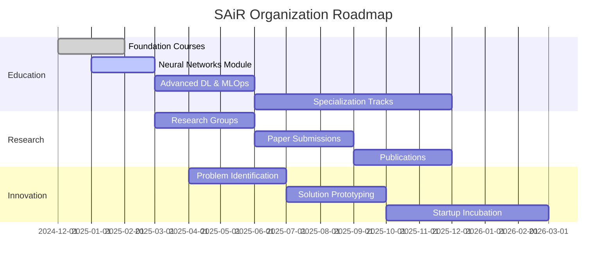

# 🇸🇩 SAiR – Sudanese Artificial Intelligence Research Organization

<div align="center">

<!-- Hero Banner -->


<br/>

<!-- Dynamic Badges Grid -->
<table>
<tr>
<td align="center">
<a href="https://t.me/+jPPlO6ZFDbtlYzU0">

</a>
</td>
<td align="center">
<a href="https://github.com/SAIR-Org/SAIR_Courses">

</a>
</td>
<td align="center">

</td>
<td align="center">

</td>
</tr>
</table>

<br/>

<!-- Mission Statement -->
<h3>

Building Sudan's AI Talent Pipeline from Education to Innovation

</h3>

**Founded:** December 2024 | **Last Updated:** December 2025  
**Founder & CEO:** [Mohammed Awad Ahmed (Silva)](https://www.linkedin.com/in/maas-ai)

</div>

---

## 👨‍💼 Meet the Founder

<div align="center">


<br/><br/>

<!-- Founder Links Grid -->
<table>
<tr>
<td align="center" width="33%">
<a href="https://www.linkedin.com/in/maas-ai">

<br/><br/>

<br/><br/>
<strong>Professional Profile</strong><br/>
Connect on LinkedIn
</a>
</td>
<td align="center" width="33%">
<a href="https://github.com/silvaxxx1">

<br/><br/>

<br/><br/>
<strong>@silvaxxx1</strong><br/>
Open Source Work
</a>
</td>
<td align="center" width="33%">
<a href="https://silvaxxx1.github.io/MyWebsite/">

<br/><br/>

<br/><br/>
<strong>Personal Website</strong><br/>
Projects & Research
</a>
</td>
</tr>
</table>

<br/>

<!-- Vision Quote Box -->
<table>
<tr>
<td>

</td>
<td>
<h3 align="left">Founder's Vision</h3>
<p align="left">
<em>"I believe talent is equally distributed, but opportunity is not. SAiR exists to change that equation for Sudanese and African AI enthusiasts. We're building more than just courses - we're creating a pipeline that transforms learners into innovators who can solve real-world problems."</em>
</p>
</td>
</tr>
</table>

</div>

**Mohammed Awad Ahmed (Silva)** is a Sudanese AI engineer, researcher, and passionate educator dedicated to democratizing artificial intelligence education in Sudan and across Africa. With expertise in both theoretical foundations and practical applications, he founded SAiR to create a sustainable AI ecosystem that nurtures local talent and prepares them for global challenges.

---

## 🌍 About SAiR

<div align="center">

<!-- SAiR Logo Concept -->


<br/><br/>

<!-- Dual Focus Cards -->
<table>
<tr>
<td width="50%" valign="top">
<div align="center">

### 🎯 Current Focus
**Phase 1: Education**


</div>

Building foundational AI/ML skills through practical, project-based courses. We've completed the first deep learning module and are actively training the next generation of Sudanese AI talent.

**Achievements:**
- ✅ 200+ Active Learners
- ✅ 2 Modules Completed
- ✅ 15+ Student Projects
- 🔄 Neural Networks Module Active

</td>
<td width="50%" valign="top">
<div align="center">

### 🚀 Future Vision
**Complete AI Ecosystem**


</div>

Creating a self-sustaining AI ecosystem in Sudan where education leads to research, innovation leads to solutions, and talent leads to global impact.

**Roadmap:**
- 🕐 Research Publications
- 🕐 Innovation Hub Launch
- 🕐 Startup Incubation
- 🕐 Pan-African Expansion

</td>
</tr>
</table>

<br/>

<!-- Development Timeline -->
### 📊 SAiR Development Journey



</div>

---

## 🏛️ Organization Architecture

<div align="center">

```
┏━━━━━━━━━━━━━━━━━━━━━━━━━━━━━━━━━━━━━━━━━━━━━━━━━━━━━━━━━━━━━━┓
┃                  🌐 SAiR ORGANIZATION                           ┃
┃              Building Sudan's AI Future Together                ┃
┗━━━━━━━━━━━━━━━━━━━━━━━━━━━━━━━━━━━━━━━━━━━━━━━━━━━━━━━━━━━━━━┛
                              │
        ┌─────────────────────┼─────────────────────┐
        │                     │                     │
        ▼                     ▼                     ▼
┌──────────────────┐ ┌──────────────────┐ ┌──────────────────┐
│   📚 EDUCATION   │ │  🧪 RESEARCH LAB │ │ 💡 INNOVATION HUB│
│  (Current Focus) │ │     (Future)     │ │     (Future)     │
└──────────────────┘ └──────────────────┘ └──────────────────┘
        │                     │                     │
        ├─ 🎯 Foundation      ├─ 📄 Publications   ├─ 🏗️ Solutions
        ├─ 🚀 Projects        ├─ 🔓 Open Source    ├─ 🚀 Startups
        ├─ 👥 Community       ├─ 🤝 Collaborations ├─ 🤖 Edge AI
        └─ 💼 Portfolio       └─ 🎓 Mentorship     └─ 🌍 Africa Focus
                              │
                              ▼
                    ┌──────────────────┐
                    │ 🌍 SAiR COMMUNITY│
                    │  The Heart of AI │
                    └──────────────────┘
                              │
                    ├─ 💬 Networks (500+)
                    ├─ 👨‍🏫 Mentorship
                    ├─ 🏆 Competitions
                    └─ 🔗 Industry Links
```

</div>

---

## 📚 Educational Programs

<div align="center">

### 🎓 SAiR Learning Journey


<br/><br/>

<!-- Progress Bar Visual -->
<table>
<thead>
<tr>
<th width="25%">🎯 Module</th>
<th width="15%">Progress</th>
<th width="30%">Focus Areas</th>
<th width="30%">Student Outcomes</th>
</tr>
</thead>
<tbody>
<tr>
<td align="center">
<br/>
<strong>ML Foundations</strong>
</td>
<td align="center">

<br/>✅ Complete
</td>
<td>
• Python Fundamentals<br/>
• Data Science Tools<br/>
• Exploratory Analysis<br/>
• Feature Engineering
</td>
<td>
<br/>
Basic ML Implementation<br/>
Data Preprocessing Skills
</td>
</tr>
<tr>
<td align="center">
<br/>
<strong>Regression & Classification</strong>
</td>
<td align="center">

<br/>✅ Complete
</td>
<td>
• Scikit-learn Mastery<br/>
• ML Pipelines<br/>
• Model Selection<br/>
• Cross-validation
</td>
<td>
<br/>
Production-Ready Models<br/>
End-to-End Workflows
</td>
</tr>
<tr style="background-color: #E8F5E9;">
<td align="center">
<br/>
<strong>Neural Networks</strong>
</td>
<td align="center">

<br/>🟢 <strong>ACTIVE</strong>
</td>
<td>
• <strong>DL from Scratch</strong><br/>
• <strong>NumPy Implementation</strong><br/>
• <strong>Backpropagation</strong><br/>
• <strong>Optimization Algorithms</strong>
</td>
<td>
<br/>
<strong>Deep Learning Fundamentals</strong><br/>
<strong>Custom Neural Networks</strong>
</td>
</tr>
<tr>
<td align="center">
<br/>
<strong>Advanced DL</strong>
</td>
<td align="center">

<br/>🟡 Q2 2025
</td>
<td>
• PyTorch Framework<br/>
• CNN Architectures<br/>
• RNN & Transformers<br/>
• Transfer Learning
</td>
<td>
<br/>
Modern AI Architectures<br/>
State-of-the-Art Models
</td>
</tr>
<tr>
<td align="center">
<br/>
<strong>MLOps & Production</strong>
</td>
<td align="center">

<br/>🟡 Q3 2025
</td>
<td>
• Model Deployment<br/>
• Cloud Platforms<br/>
• Monitoring Systems<br/>
• CI/CD Pipelines
</td>
<td>
<br/>
End-to-End AI Systems<br/>
Production Deployment
</td>
</tr>
</tbody>
</table>

</div>

---

### 🎯 Current Module Spotlight

<div align="center">


<br/>

<table>
<tr>
<td width="50%" valign="top">

#### 🧠 What We're Building

 **Core Concepts:**
- Neural network architecture design
- Forward & backward propagation
- Gradient descent optimization
- Activation functions (ReLU, Sigmoid, Tanh)
- Custom deep learning library

 **Technologies:**
```
NumPy | Matplotlib | Pandas
Math | Algorithm Design
```

</td>
<td width="50%" valign="top">

#### 🚀 Student Projects

 **Active Projects:**
- MNIST digit classification (99% accuracy)
- Fashion-MNIST recognition system
- Custom NN library (NumPy-based)
- Performance optimization techniques
- Real-time model evaluation

 **Project Stats:**
```
15 Active Projects | 40 Students
85% Completion Rate
```

</td>
</tr>
</table>

</div>

---

### 🌟 Featured Student Success Stories

<div align="center">

<table>
<tr>
<td align="center" width="33%">

<h4>Ahmed Hassan</h4>

<br/><br/>
<strong>LSTM Model for Jet Engines</strong><br/>
Predicting maintenance needs<br/>
using time-series analysis
<br/><br/>

</td>
<td align="center" width="33%">

<h4>Sara Mohamed</h4>

<br/><br/>
<strong>Health Score Predictor</strong><br/>
XGBoost deployment for<br/>
Sudanese health metrics
<br/><br/>

</td>
<td align="center" width="33%">

<h4>Khalid Ibrahim</h4>

<br/><br/>
<strong>Crop Disease Detection</strong><br/>
CNN-based agricultural<br/>
assistant for farmers
<br/><br/>

</td>
</tr>
</table>

</div>

---

## 🎯 Mission, Vision & Values

<div align="center">

<table>
<tr>
<td width="50%" valign="top">

### 🎯 Mission Statement


<br/>

To **democratize AI education** and empower Sudanese talent through practical learning, community support, and real-world projects that lead to global competitiveness.

**Core Commitments:**
- 🎓 Free, high-quality education
- 🌍 Focus on African challenges
- 🤝 Community-driven growth
- 🚀 Real-world impact

</td>
<td width="50%" valign="top">

### 🌟 Vision Statement


<br/>

To establish **Sudan as a recognized hub** for AI innovation in Africa, where local talent develops solutions for local challenges while contributing to global AI advancement.

**Future Goals:**
- 🏆 Regional AI excellence
- 🔬 Research contributions
- 💼 Global competitiveness
- 🌍 Pan-African impact

</td>
</tr>
</table>

<br/>

<!-- Educational Philosophy -->
<table>
<tr>
<td align="center">

</td>
<td width="100%">
<h3>📖 Educational Philosophy</h3>
<p><em>"Theory in lectures, practice in code, mastery in projects, impact in community."</em></p>
</td>
</tr>
</table>

<!-- Value Propositions Grid -->
<table>
<tr>
<td align="center" width="25%">

<br/><br/>
<strong>Accessibility</strong><br/>
Free, high-quality<br/>AI education for all
</td>
<td align="center" width="25%">

<br/><br/>
<strong>Practicality</strong><br/>
Project-based learning<br/>from day one
</td>
<td align="center" width="25%">

<br/><br/>
<strong>Community</strong><br/>
Supportive network of<br/>peers and mentors
</td>
<td align="center" width="25%">

<br/><br/>
<strong>Impact</strong><br/>
Solving real<br/>African challenges
</td>
</tr>
</table>

</div>

---

## 🌐 Join the SAiR Community

<div align="center">


<br/><br/>

<!-- Engagement Cards -->
<table>
<tr>
<td align="center" width="25%">
<a href="https://t.me/+jPPlO6ZFDbtlYzU0">

<br/><br/>

<br/><br/>
<strong>Connect & Learn</strong><br/>
200+ members helping<br/>each other grow
</a>
</td>
<td align="center" width="25%">
<a href="https://github.com/SAIR-Org/SAIR_Courses">

<br/><br/>

<br/><br/>
<strong>Start Learning</strong><br/>
Free courses with<br/>hands-on projects
</a>
</td>
<td align="center" width="25%">
<a href="mailto:silvaxxx1@gmail.com">

<br/><br/>

<br/><br/>
<strong>Partner With Us</strong><br/>
Academic & industry<br/>collaborations
</a>
</td>
<td align="center" width="25%">
<a href="https://silvaxxx1.github.io/MyWebsite/">

<br/><br/>

<br/><br/>
<strong>Discover More</strong><br/>
Projects, updates<br/>& founder's work
</a>
</td>
</tr>
</table>

<br/>

### 📅 Weekly Community Activities

<table>
<thead>
<tr>
<th width="14%">Monday</th>
<th width="14%">Tuesday</th>
<th width="14%">Wednesday</th>
<th width="14%">Thursday</th>
<th width="14%">Friday</th>
<th width="14%">Saturday</th>
<th width="14%">Sunday</th>
</tr>
</thead>
<tbody>
<tr>
<td align="center">
🎯<br/><strong>Goals</strong><br/>Weekly<br/>Planning
</td>
<td align="center">
📚<br/><strong>Review</strong><br/>Module<br/>Sessions
</td>
<td align="center">
🎤<br/><strong>Speakers</strong><br/>Guest<br/>Series
</td>
<td align="center">
💻<br/><strong>Projects</strong><br/>Work<br/>Sessions
</td>
<td align="center">
👨‍💻<br/><strong>Code Review</strong><br/>Clinic<br/>Help
</td>
<td align="center">
❓<br/><strong>Q&A</strong><br/>Marathon<br/>All Mentors
</td>
<td align="center">
🏆<br/><strong>Showcases</strong><br/>Project<br/>Presentations
</td>
</tr>
<tr>
<td align="center" colspan="7">
<small><em>All sessions at 7:00 PM UTC+2 unless specified</em></small>
</td>
</tr>
</tbody>
</table>

</div>

---

## 🚀 Roadmap & Future Vision

<div align="center">

### 🗺️ SAiR Development Roadmap 2025-2026


<br/><br/>

<!-- Roadmap Timeline -->
<table>
<thead>
<tr>
<th width="15%">Timeline</th>
<th width="28%">🎓 Educational Goals</th>
<th width="28%">🔬 Research Goals</th>
<th width="29%">💡 Innovation Goals</th>
</tr>
</thead>
<tbody>
<tr>
<td align="center">
<strong>Q1 2025</strong><br/>
<small>Jan - Mar</small>
</td>
<td>
<br/>
• Complete Neural Networks<br/>
• Launch Advanced DL Module<br/>
• Expand to 500+ learners
</td>
<td>
<br/>
• Research reading groups<br/>
• Paper discussion forums<br/>
• Literature review sessions
</td>
<td>
<br/>
• Identify key challenges<br/>
• Problem statement workshops<br/>
• Solution brainstorming
</td>
</tr>
<tr>
<td align="center">
<strong>Q2 2025</strong><br/>
<small>Apr - Jun</small>
</td>
<td>
<br/>
• MLOps module launch<br/>
• First cohort graduation<br/>
• Industry certification prep
</td>
<td>
<br/>
• Start collaborative papers<br/>
• Open-source contributions<br/>
• Conference preparations
</td>
<td>
<br/>
• Prototype first solutions<br/>
• Minimum viable products<br/>
• User testing & feedback
</td>
</tr>
<tr>
<td align="center">
<strong>Q3 2025</strong><br/>
<small>Jul - Sep</small>
</td>
<td>
<br/>
• Advanced tracks launch<br/>
• Industry partnerships<br/>
• Specialization programs
</td>
<td>
<br/>
• Conference submissions<br/>
• Workshop organization<br/>
• Research mentorship
</td>
<td>
<br/>
• Incubation program pilot<br/>
• MVP deployments<br/>
• Impact assessment
</td>
</tr>
<tr>
<td align="center">
<strong>Q4 2025</strong><br/>
<small>Oct - Dec</small>
</td>
<td>
<br/>
• Full specialization tracks<br/>
• Certification system<br/>
• Alumni network launch
</td>
<td>
<br/>
• Journal publications<br/>
• Research grants<br/>
• International collaborations
</td>
<td>
<br/>
• First startup launches<br/>
• Funding rounds<br/>
• Scale preparation
</td>
</tr>
</tbody>
</table>

<br/>

### 🎯 Immediate Priorities

<table>
<tr>
<td align="center" width="20%">
<h3>1️⃣</h3>
<br/>
<strong>Complete Current Module</strong><br/>
Deep learning mastery
</td>
<td align="center" width="20%">
<h3>2️⃣</h3>
<br/>
<strong>Expand Community</strong><br/>
500+ active learners
</td>
<td align="center" width="20%">
<h3>3️⃣</h3>
<br/>
<strong>Develop Advanced Curriculum</strong><br/>
Mid/senior tracks
</td>
<td align="center" width="20%">
<h3>4️⃣</h3>
<br/>
<strong>Industry Partnerships</strong><br/>
Real-world projects
</td>
<td align="center" width="20%">
<h3>5️⃣</h3>
<br/>
<strong>Research Collaborations</strong><br/>
Academic institutions
</td>
</tr>
</table>

</div>

---

## 🤝 Partnerships & Collaborations

<div align="center">


<br/><br/>

<!-- Partnership Grid -->
<table>
<tr>
<td align="center" width="25%">

<br/><br/>
<strong>🏫 Academic</strong><br/>
Universities &<br/>Research Institutions
<br/><br/>
<small>Seeking curriculum development partnerships and research collaborations</small>
</td>
<td align="center" width="25%">

<br/><br/>
<strong>🏢 Industry</strong><br/>
Tech Companies &<br/>AI Organizations
<br/><br/>
<small>Looking for mentorship programs, project sponsorship, and talent pipelines</small>
</td>
<td align="center" width="25%">

<br/><br/>
<strong>🌍 Global</strong><br/>
International AI<br/>Communities
<br/><br/>
<small>Open to knowledge sharing, best practices, and cross-border collaborations</small>
</td>
<td align="center" width="25%">

<br/><br/>
<strong>🇸🇩 Local</strong><br/>
Sudanese Tech<br/>Ecosystem
<br/><br/>
<small>Engaging with local startups, tech hubs, and innovation centers</small>
</td>
</tr>
</table>

<br/>

### 🎯 Seeking Collaborations In:

<table>
<tr>
<td width="33%" valign="top">
<h4>📚 Curriculum Development</h4>
• Joint educational programs<br/>
• Course material sharing<br/>
• Certification partnerships<br/>
• Learning platform integration
</td>
<td width="33%" valign="top">
<h4>🔬 Research Projects</h4>
• Collaborative AI research<br/>
• Data sharing agreements<br/>
• Joint publications<br/>
• Conference organization
</td>
<td width="34%" valign="top">
<h4>💼 Mentorship & Resources</h4>
• Industry expert guidance<br/>
• Computing infrastructure<br/>
• Dataset contributions<br/>
• Project sponsorship
</td>
</tr>
</table>

</div>

---

## 📊 Impact Metrics & Progress

<div align="center">

### 📈 SAiR Impact Dashboard


<br/>

<table>
<thead>
<tr>
<th width="25%">🎯 Metric Category</th>
<th width="25%">📊 Current Status</th>
<th width="25%">🎯 Q2 2025 Goal</th>
<th width="25%">🚀 Year-End Goal</th>
</tr>
</thead>
<tbody>
<tr>
<td align="center">
<br/>
<strong>👥 Community Size</strong>
</td>
<td align="center">
<br/>
Growing Telegram group<br/>
Active participation
</td>
<td align="center">
<br/>
Expand to new regions<br/>
Diverse backgrounds
</td>
<td align="center">
<br/>
Pan-African reach<br/>
Strong alumni network
</td>
</tr>
<tr>
<td align="center">
<br/>
<strong>📚 Courses Completed</strong>
</td>
<td align="center">
<br/>
Foundation & Regression<br/>
Current: Neural Networks
</td>
<td align="center">
<br/>
Add MLOps<br/>
Advanced curriculum
</td>
<td align="center">
<br/>
Full specialization<br/>
Advanced tracks
</td>
</tr>
<tr>
<td align="center">
<br/>
<strong>🚀 Projects Built</strong>
</td>
<td align="center">
<br/>
Real-world applications<br/>
Portfolio-ready work
</td>
<td align="center">
<br/>
Industry collaborations<br/>
Complex solutions
</td>
<td align="center">
<br/>
Production deployments<br/>
Startup launches
</td>
</tr>
<tr>
<td align="center">
<br/>
<strong>🌍 Geographic Reach</strong>
</td>
<td align="center">
<br/>
Local talent development<br/>
Community building
</td>
<td align="center">
<br/>
Regional expansion<br/>
Cross-border learning
</td>
<td align="center">
<br/>
Continent-wide impact<br/>
Global recognition
</td>
</tr>
<tr>
<td align="center">
<br/>
<strong>🏆 Student Success</strong>
</td>
<td align="center">
<br/>
High engagement rate<br/>
Active participation
</td>
<td align="center">
<br/>
Improved support<br/>
Better resources
</td>
<td align="center">
<br/>
Alumni achievements<br/>
Career placements
</td>
</tr>
</tbody>
</table>

</div>

---

## 📜 Open Source & Contribution

<div align="center">


<h3>Embracing Open Education & Collaboration</h3>

<p>SAiR operates under <strong>open education principles</strong>. All course materials, code examples, and learning resources are freely available for educational purposes.</p>

<br/>

<!-- Contribution Grid -->
<table>
<tr>
<td align="center" width="20%">

<br/><br/>
<strong>📚 Improve Curriculum</strong><br/>
Enhance existing modules
</td>
<td align="center" width="20%">

<br/><br/>
<strong>💡 Add Content</strong><br/>
Create new learning materials
</td>
<td align="center" width="20%">

<br/><br/>
<strong>🌍 Translate</strong><br/>
Make resources available in Arabic
</td>
<td align="center" width="20%">

<br/><br/>
<strong>👨‍🏫 Mentor</strong><br/>
Guide next generation learners
</td>
<td align="center" width="20%">

<br/><br/>
<strong>🎁 Donate Resources</strong><br/>
Computing power, datasets
</td>
</tr>
</table>

</div>

---

<div align="center">

## 🌟 Join the SAiR Movement Today!


<h3>Every transformative journey begins with education. Start walking with us.</h3>

<br/>

<!-- Final CTA Buttons -->
<table>
<tr>
<td align="center">
<a href="https://github.com/SAIR-Org/SAIR_Courses">

</a>
</td>
<td align="center">
<a href="https://t.me/+jPPlO6ZFDbtlYzU0">

</a>
</td>
<td align="center">
<a href="mailto:silvaxxx1@gmail.com">

</a>
</td>
</tr>
</table>

<br/><br/>


<br/>

<h2>From Sudan 🇸🇩, for Africa ❤️, to the World 🌎</h2>

<hr/>

**Founder & CEO:** [Mohammed Awad Ahmed (Silva)](https://www.linkedin.com/in/maas-ai)  
**Contact:** silvaxxx1@gmail.com | [GitHub](https://github.com/silvaxxx1) | [Portfolio](https://silvaxxx1.github.io/MyWebsite/)

*Last Updated: December 2025 | SAiR Organization v2.0*

<!-- Visitor Counter -->
<p align="center">
  
</p>

</div>
