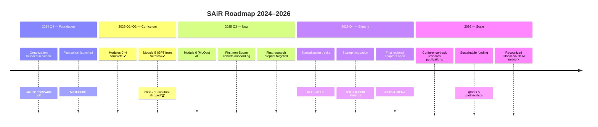

<div align="center">


<h2>We teach people to build AI from first principles — for free, wherever they're starting from.</h2>

<p><strong>Founded</strong> December 2024, in Sudan &nbsp;•&nbsp; <strong>Open to</strong> Africa, the Middle East & the wider Global South &nbsp;•&nbsp; <strong>Founder</strong> <a href="https://www.linkedin.com/in/maas-ai">Mohammed Awad Ahmed (Silva)</a></p>

<table>
<tr>
<td align="center"><a href="https://t.me/+jPPlO6ZFDbtlYzU0"></a></td>
<td align="center"><a href="https://github.com/SAIR-Org/SAIR_Jr"></a></td>
<td align="center"><a href="https://github.com/SAIR-Org/miniGPT"></a></td>
<td align="center"></td>
</tr>
</table>

</div>

---

## 👋 New here? Start in 30 seconds

| I want to... | Go to |
|---|---|
| 🎓 **Learn AI for free, from scratch** | [SAiR Jr. Curriculum](#-sair-jr-curriculum) → [enroll on GitHub](https://github.com/SAIR-Org/SAIR_Jr) |
| 🏆 **See what students actually build** | [miniGPT Capstone](#-capstone-minigpt) |
| 🤝 **Join the community / find mentors** | [Join the SAiR Community](#-join-the-sair-community) |
| 🌍 **Start a chapter in my country** | [Why We Expanded](#-why-we-expanded-beyond-sudan) → [Contact](#-contact--support) |
| 🧭 **Understand where SAiR is headed** | [Roadmap](#-roadmap-where-were-headed) |

---

## 📖 Table of Contents

- [👨‍💼 Meet the Founder](#-meet-the-founder)
- [🌍 About SAiR](#-about-sair)
- [🌐 Why We Expanded Beyond Sudan](#-why-we-expanded-beyond-sudan)
- [🏛️ How SAiR Is Organized](#️-how-sair-is-organized)
- [📚 SAiR Jr. Curriculum](#-sair-jr-curriculum)
- [🏆 Capstone: miniGPT](#-capstone-minigpt)
- [🎯 Mission, Vision & Values](#-mission-vision--values)
- [📊 Impact So Far](#-impact-so-far)
- [🌐 Join the SAiR Community](#-join-the-sair-community)
- [🧭 Roadmap: Where We're Headed](#-roadmap-where-were-headed)
- [📜 Open Source & Contribution](#-open-source--contribution)
- [💬 Contact & Support](#-contact--support)

---

## 👨‍💼 Meet the Founder

<div align="center">


<br/><br/>

<table>
<tr>
<td align="center" width="33%">
<a href="https://www.linkedin.com/in/maas-ai">

<br/><br/>

<br/><br/><strong>Professional Profile</strong>
</a>
</td>
<td align="center" width="33%">
<a href="https://github.com/silvaxxx1">

<br/><br/>

<br/><br/><strong>@silvaxxx1</strong>
</a>
</td>
<td align="center" width="33%">
<a href="https://silvaxxx1.github.io/MyWebsite/">

<br/><br/>

<br/><br/><strong>Personal Website</strong>
</a>
</td>
</tr>
</table>

<br/>

<table>
<tr>
<td width="8%"></td>
<td>
<h3 align="left">Founder's Vision</h3>
<p align="left"><em>"I believe talent is equally distributed, but opportunity is not. SAiR started in Sudan because that's where I saw the gap most clearly — but the gap isn't unique to Sudan. It's the same story across dozens of countries in Africa, the Middle East, and South Asia: brilliant people with no on-ramp into AI. SAiR exists to build that on-ramp, wherever it's missing. We're not building a Sudanese course catalog — we're building a pipeline that turns learners anywhere into engineers who can ship real systems."</em></p>
</td>
</tr>
</table>

</div>

**Mohammed Awad Ahmed (Silva)** is a Sudanese AI engineer, researcher, and educator who founded SAiR to close a local gap in AI education. From day one, the curriculum, community, and tooling were built to be **region-agnostic** — free, remote-first, and grounded in fundamentals that travel anywhere there's an internet connection and the will to learn.

**Key achievements:** 200+ students trained · 5 complete modules · a full GPT built from scratch (miniGPT) · a growing multi-regional community · 39+ passing tests on production-grade student code.

---

## 🌍 About SAiR

<div align="center">


<br/><br/>

<table>
<tr>
<td align="center"></td>
<td align="center"></td>
<td align="center"></td>
<td align="center"></td>
</tr>
</table>
</div>

**SAiR (سير — "walking on a road")** is a free, project-based AI education organization. Learners don't just call `model.fit()` — they build the tokenizer, the attention mechanism, and the training loop themselves, then ship a working system. The name is the philosophy: AI mastery is a road you walk step by step, not a shortcut you take.

<table>
<tr>
<td width="50%" valign="top">

### 🎯 Right Now
**SAiR Jr. Program**

5 of 6 modules are live. Students — now joining from beyond Sudan — have gone from linear regression to a full GPT implementation from scratch.

- ✅ Modules 0–5 complete
- ✅ 1 production capstone ([miniGPT](https://github.com/SAIR-Org/miniGPT))
- ✅ 200+ active learners, multiple regions
- 🔜 Module 6 (MLOps) in progress

</td>
<td width="50%" valign="top">

### 🚀 Where This Goes
**A Global-South AI Network**

Sudan is home base. The plan is a network of chapters across Africa and the Middle East, running the same rigorous curriculum with locally-relevant projects.

- 🔜 MLOps module launch
- 🔜 First regional chapters
- 🔜 First research preprint
- 🔜 Innovation hub for graduate projects

</td>
</tr>
</table>

### 🎓 What Makes SAiR Different

<table>
<tr>
<td width="25%" align="center"><br/><strong>Build From Scratch</strong><br/><small>We don't just import libraries — we build them</small></td>
<td width="25%" align="center"><br/><strong>Completely Free</strong><br/><small>No tuition, no hidden costs, no border</small></td>
<td width="25%" align="center"><br/><strong>Real Community</strong><br/><small>Peer mentorship, not a self-paced ghost town</small></td>
<td width="25%" align="center"><br/><strong>Locally Relevant</strong><br/><small>Your capstone can target any local problem, anywhere</small></td>
</tr>
</table>

---

## 🌐 Why We Expanded Beyond Sudan

SAiR began as a response to one specific gap: Sudan has enormous technical talent and almost no structured, free path into modern AI engineering. As the first cohorts grew, three things became obvious:

1. **The gap is regional, not national.** Learners from other African and Middle Eastern countries facing the exact same problem started asking to join.
2. **The curriculum was already region-agnostic.** Tokenizers, attention, training loops — none of it requires Sudanese context to teach or to learn. It travels.
3. **A bigger community compounds.** More learners means more peer mentors, more project diversity, and a stronger case to universities, employers, and funders that this pipeline works at scale.

So we're stating it plainly: **SAiR is Sudanese-founded, but not Sudan-only.** Sudan is the origin story and a permanent home base — not a ceiling.

| | Before | Now |
|---|---|---|
| **Who it's for** | Sudanese AI enthusiasts | Learners across Africa, the Middle East, and the Global South |
| **Framing** | "Sudan's AI future" | A shared, multi-regional AI future |
| **Structure** | Single, Sudan-based group | Sudan HQ + regional chapters as they form |
| **Language** | Arabic/English (Sudan) | Arabic/English core, open to local-language chapters |

---

## 🏛️ How SAiR Is Organized

<div align="center">

```
┏━━━━━━━━━━━━━━━━━━━━━━━━━━━━━━━━━━━━━━━━━━━━━━━━━━━━━━━━━━━━━━┓
┃                     🌐 SAiR ORGANIZATION                         ┃
┃            Sudanese-Founded · Multi-Regional · Free              ┃
┗━━━━━━━━━━━━━━━━━━━━━━━━━━━━━━━━━━━━━━━━━━━━━━━━━━━━━━━━━━━━━━┛
                              │
        ┌─────────────────────┼─────────────────────┐
        │                     │                     │
        ▼                     ▼                     ▼
┌──────────────────┐ ┌──────────────────┐ ┌──────────────────┐
│   📚 EDUCATION   │ │  🧭 ROADMAP      │ │ 💡 INNOVATION HUB│
│  (Live Now)      │ │  (What's Next)   │ │    (Future)      │
└──────────────────┘ └──────────────────┘ └──────────────────┘
        │                     │                     │
        ├─ 🎓 SAiR Jr. ✅     ├─ ⚙️ MLOps Module    ├─ 🏗️ Grad Projects
        ├─ 🚀 Capstones       ├─ 🌍 New Chapters    ├─ 🚀 Startup Incubation
        ├─ 👥 Community       ├─ 📄 Research Track  ├─ 🤖 Edge AI Deployment
        └─ 💼 Portfolios      └─ 🎓 Specializations └─ 🌍 Regional Solutions
                              │
                              ▼
                    ┌──────────────────┐
                    │ 🌍 SAiR COMMUNITY│
                    │ Sudan HQ + Chapters│
                    └──────────────────┘
                              │
                    ├─ 💬 500+ Members, Multi-Region
                    ├─ 👨‍🏫 Peer Mentorship
                    ├─ 🏆 Competitions & Showcases
                    └─ 🔗 Industry Links
```

</div>

Three pillars, one path: **Education** gets you building today. **Roadmap** is the concrete, dated plan for what SAiR ships next — see the [full roadmap](#-roadmap-where-were-headed) below. **Innovation Hub** is where graduates take what they've built and turn it into startups, deployed tools, and local solutions.

---

## 📚 SAiR Jr. Curriculum

<div align="center">

### From Zero to AI Engineer, Wherever You Are


<br/><br/>

<table>
<thead>
<tr><th width="12%">Module</th><th width="28%">What You'll Learn</th><th width="12%">Status</th><th width="18%">Build & Deploy</th><th width="30%">Key Achievement</th></tr>
</thead>
<tbody>
<tr><td align="center"><strong>0 🐍</strong></td><td><strong>Python for Data Science</strong><br/><em>NumPy, Pandas, Visualization</em></td><td align="center">✅ Complete</td><td>Data analysis scripts</td><td>Data wrangling mastery</td></tr>
<tr><td align="center"><strong>1 📈</strong></td><td><strong>Your First ML Model</strong><br/><em>Regression, Scikit-learn</em></td><td align="center">✅ Complete</td><td>Deployed prediction API</td><td>End-to-end ML pipeline</td></tr>
<tr><td align="center"><strong>2 🎯</strong></td><td><strong>Production ML Systems</strong><br/><em>Classification, Pipelines</em></td><td align="center">✅ Complete</td><td>End-to-end ML pipeline</td><td>Production thinking</td></tr>
<tr><td align="center"><strong>3 🧠</strong></td><td><strong>Neural Networks Deep Dive</strong><br/><em>Built from scratch, Math</em></td><td align="center">✅ Complete</td><td>Custom neural network library</td><td>Fundamental understanding</td></tr>
<tr><td align="center"><strong>4 🔥</strong></td><td><strong>Applied Deep Learning</strong><br/><em>PyTorch, CNN, RNN, Transformers</em></td><td align="center">✅ Complete</td><td>Vision apps, NLP pipelines</td><td>Modern AI development</td></tr>
<tr style="background-color:#E8F5E9;"><td align="center"><strong>5 🧠</strong></td><td><strong>GPT from Scratch</strong><br/><em>Attention, transformer, SFT</em></td><td align="center">✅ <strong>Complete</strong></td><td><a href="https://github.com/SAIR-Org/miniGPT">miniGPT</a> — full GPT system</td><td>LLM implementation from scratch</td></tr>
<tr><td align="center"><strong>6 ⚙️</strong></td><td><strong>MLOps</strong><br/><em>Docker, FastAPI, MLflow, CI/CD</em></td><td align="center">🔜 <strong>Coming Soon</strong></td><td>Production ML system</td><td>Full deployment lifecycle</td></tr>
</tbody>
</table>

</div>

### 🔥 Module 5: GPT from Scratch — The Capstone

<table>
<tr>
<td width="60%" valign="top">

**8 Notebooks — 5 core + 3 appendix:**
1. Data & Tokenization — custom tokenizer + tiktoken BPE
2. Attention Mechanisms — multi-head causal attention from scratch
3. GPT Architecture — 124M-parameter GPT-2 implementation
4. Training Loop — V0→V4 with DDP and mixed precision
5. Inference — greedy, temperature, top-k, beam search
6. A0: PyTorch Crash Course
7. A1: SFT for Text Classification
8. A2: SFT for Instruction Following

</td>
<td width="40%" valign="top">

**miniGPT — what students ship:**
- 🖥️ `sair` CLI, 4+ commands
- ☁️ Modal cloud training (A100)
- 📊 W&B integration + loss plots
- 🌐 Web UI (Gradio)
- 🧪 39 passing tests
- 🔧 Fine-tuning pipelines

</td>
</tr>
</table>

---

## 🏆 Capstone: miniGPT

<div align="center">

<p align="center"></p>

<h3>Build a GPT. Train it. Talk to it.</h3>
<p>A full-stack, hackable GPT playground — from raw text to a live web UI.</p>

<p>
<a href="https://github.com/SAIR-Org/miniGPT"></a>


</p>

</div>

**Quick start — Modal cloud, 3 steps:**

```bash
# 1. Train on Modal A100 (~3 hrs, ~$12–15)
uv run python -m modal run train/modal_train.py::main

# 2. Download the final checkpoint
uv run python -m modal run train/modal_train.py::download

# 3. Launch the web UI and demo it live
uv run sair ui        # → http://localhost:7860
```

| Feature | What it does |
|---|---|
| 🖥️ `sair` CLI | Go from raw text to trained model in a few commands |
| 📄 Multi-format data | `.txt` and `.pdf` files as training data |
| ☁️ Flexible training | Local CPU/GPU · Modal A100 cloud · multi-GPU DDP |
| 📊 W&B + plots | Live loss curves + PNG saved after training |
| 🌐 Web UI | Chat with your model in the browser |
| 🚀 Pretrained models | Load GPT-2 (124M → 1.5B) without training |

**Real example:** a `medium` preset (~163M params) trained on 6 Harry Potter books for ~$12–15 and ~3 hours on a Modal A100, producing a model that generates coherent Harry Potter-style text.

```
uv run python -m pytest tests/ -v
→ 39 passed in 8.65s
```

```
miniGPT/
├── config.py               ← all hyperparams
├── cli.py                  ← sair prepare | train | generate | ui
├── data/                   ← data preparation & dataset
├── model/                  ← GPTModel: LayerNorm → MHA → FFN → Block
├── train/                  ← trainerV3, DDP, Modal cloud
├── inference/              ← generateV0→V3, weight loading
├── ui/                     ← FastAPI backend + SAIR-branded web UI
├── finetune/               ← SFT for classification & instruction
├── tests/                  ← 39 tests covering full pipeline
└── ui_finetune/             ← fine-tuning web interface
```

> 📖 Full docs: [miniGPT GitHub Repository](https://github.com/SAIR-Org/miniGPT)

---

## 🎯 Mission, Vision & Values

<table>
<tr>
<td width="50%" valign="top">

### 🎯 Mission
To **democratize AI education globally**, starting from Sudan and extending to every region where access to high-quality, practical AI training is scarce — through free education, community, and real projects that lead to global competitiveness.

- 🎓 Free, high-quality education, open to any region
- 🌍 Curriculum rooted in fundamentals, adaptable anywhere
- 🤝 Community-driven growth across borders
- 🚀 Real-world impact, wherever our learners are

</td>
<td width="50%" valign="top">

### 🌟 Vision
A **network of AI talent hubs across Africa, the Middle East, and the wider Global South** — anchored by our Sudan headquarters — where local talent everywhere solves local problems while contributing to global AI progress.

- 🏆 Regional AI excellence across multiple countries
- 🔬 Research contributions from a distributed community
- 💼 Global competitiveness for every graduate, regardless of origin
- 🌍 Genuinely multi-regional impact

</td>
</tr>
</table>

### 🎓 Educational Philosophy

<table>
<tr>
<td align="center"><br/><strong>Learn by Doing</strong><br/>Theory → Code → Project → Impact</td>
<td align="center"><br/><strong>Community First</strong><br/>Peer learning & mentorship, across regions</td>
<td align="center"><br/><strong>Context Matters</strong><br/>Solve the problems in front of you, wherever that is</td>
<td align="center"><br/><strong>Build Fundamentals</strong><br/>From-scratch understanding that transfers anywhere</td>
</tr>
</table>

---

## 📊 Impact So Far

<div align="center">
<table>
<tr>
<td align="center" width="20%"><br/><strong>👥 Learners</strong><br/><small>Multi-Region</small></td>
<td align="center" width="20%"><br/><strong>📚 Progress</strong></td>
<td align="center" width="20%"><br/><strong>🏆 Flagship Project</strong></td>
<td align="center" width="20%"><br/><strong>🧪 Quality</strong></td>
<td align="center" width="20%"><br/><strong>🤝 Telegram</strong></td>
</tr>
</table>
</div>

**Graduate outcomes** (SAiR Jr. + NeetCode 75 completion):

- **94%** report feeling confident in technical interviews
- **87%** complete coding challenges successfully
- **Avg. 3.2 months** to first job offer

---

## 🌐 Join the SAiR Community

<table>
<tr>
<td align="center" width="33%"><a href="https://t.me/+jPPlO6ZFDbtlYzU0"></a><br/><br/><strong>Main Community</strong><br/><small>500+ members, multi-region</small><br/>Daily discussions, Q&A, support</td>
<td align="center" width="33%"><a href="https://github.com/SAIR-Org/SAIR_Jr"></a><br/><br/><strong>Course Materials</strong><br/><small>Open source, open to all</small><br/>Code, slides, projects</td>
<td align="center" width="33%"><a href="https://github.com/SAIR-Org/miniGPT"></a><br/><br/><strong>Capstone Project</strong><br/><small>Production system</small><br/>Full GPT implementation</td>
</tr>
</table>

**Weekly rhythm (Central Africa Time — recordings shared for other zones):**

| Day | Activity | Time | Lead |
|---|---|---|---|
| 📅 Monday | Week Kick-off & Goals | 8:00 PM CAT | Mohammed (Founder) |
| 💻 Wednesday | Live Coding Session | 7:00 PM CAT | Senior Students |
| ❓ Friday | Q&A & Doubt Clearing | 6:00 PM CAT | All Mentors |
| 🚀 Saturday | Project Showcase | 4:00 PM CAT | Student Led |

---

## 🧭 Roadmap: Where We're Headed

<div align="center">


```mermaid
timeline
    title SAiR Roadmap 2024–2026
    section 2024 Q4 — Foundation
        Organization founded in Sudan : Course framework built
        First cohort launched         : 50 students
    section 2025 Q1–Q2 — Curriculum
        Modules 0–4 complete ✅
        Module 5 (GPT from Scratch) ✅ : miniGPT capstone shipped 🏆
    section 2025 Q3 — Now
        Module 6 (MLOps) 🔜
        First non-Sudan cohorts onboarding
        First research preprint targeted
    section 2025 Q4 — Expand
        Specialization tracks : NLP, CV, RL
        Startup incubation : first 3 student startups
        First regional chapters open : Africa & MENA
    section 2026 — Scale
        Conference-track research publications
        Sustainable funding : grants & partnerships
        Recognized Global-South AI network
```

</div>

### 🔜 Immediate: Module 6 — MLOps

Docker containerization · FastAPI model serving · MLflow experiment tracking · DVC data versioning · GitHub Actions CI/CD · Prometheus & Grafana monitoring. This closes the loop from "I trained a model" to "I run a model in production."

### 🌍 Near-term: First Regional Chapters

Sudan stays HQ. The plan is community-led chapters in interested African and MENA countries, running the same curriculum with local mentors and locally-relevant capstone projects — not a copy-paste of Sudan's context, but the same rigor applied to whatever problem is in front of that chapter's learners.

### 🔬 Near-term: A Research Track (not a standing lab — a roadmap item)

Rather than spinning up a permanent research division before we have the base to support it, research is a scheduled roadmap milestone: a first preprint in Q3 2025, a conference submission by Q4 2025, and journal-track publications from multi-region author teams in 2026. Early candidate areas — chosen because they map to problems our learners actually face, not to trends:

- **Low-resource NLP** — Arabic dialects and other under-resourced languages
- **Healthcare AI** — localized disease prediction
- **Agriculture tech** — climate-smart farming for local conditions
- **Renewable energy** — optimization models for varied grid contexts

### 🚀 Later: Innovation Hub

Once graduates exist in enough regions with enough projects, the Innovation Hub becomes a place to turn capstones into startups, deployed tools, and edge-AI solutions — with the same "build it yourself" ethos that got them there.

---

## 📜 Open Source & Contribution

**Everything we teach is open source** — because knowledge should be free and accessible to everyone, everywhere, especially in regions with limited resources.

```
SAIR_Jr/
├── 📂 0_Python and Data Science Tools/    ✅
├── 📂 1_Regression/                       ✅
├── 📂 2_Classification/                   ✅
├── 📂 3_Neural Network from scratch/      ✅
├── 📂 4_Applied Deep Learning with PyTorch/ ✅
├── 📂 5_GPT from scratch/                 ✅
│   └── 📁 notebooks/                      # 5 core + 3 appendix
├── 📂 6_MLOps/                            🔜 Coming Soon
├── 📂 assets/                             # Reading materials
└── 📜 README.md
```

<table>
<tr>
<td width="50%" valign="top">

**🎓 For students & learners (any region)**
1. Join our Telegram community
2. Clone the course repository
3. Complete weekly assignments
4. Submit pull requests with solutions
5. Share your projects with the community

</td>
<td width="50%" valign="top">

**👨‍🏫 For educators & experts (any region)**
1. Review course materials
2. Suggest improvements via issues
3. Create region-specific exercises or projects
4. Mentor students in the community
5. Help start a chapter if your area doesn't have one yet

</td>
</tr>
</table>

---

## 💬 Contact & Support

<table>
<tr>
<td align="center" width="33%">
<br/><br/>
<strong>Mohammed Awad Ahmed</strong><br/><small>Founder & CEO</small><br/><br/>
<a href="https://www.linkedin.com/in/maas-ai"></a><br/>
<a href="mailto:silvaxxx001@gmail.com"></a>
</td>
<td align="center" width="33%">
<br/><br/>
<strong>General Inquiries</strong><br/><small>Partnerships, media & new chapters</small><br/><br/>
<a href="mailto:sair.org.sudan@gmail.com"></a><br/>
<a href="https://t.me/+jPPlO6ZFDbtlYzU0"></a>
</td>
<td align="center" width="33%">
<br/><br/>
<strong>Student Support</strong><br/><small>Course questions</small><br/><br/>
<a href="https://github.com/SAIR-Org/SAIR_Jr/issues"></a><br/>
<a href="https://t.me/+jPPlO6ZFDbtlYzU0"></a>
</td>
</tr>
</table>

**Location:** Headquartered in Sudan (virtual-first) · **Open to:** Africa, the Middle East, and the wider Global South · **Expansion model:** Sudan HQ + community-led chapters · **Core hours:** CAT, recorded for other time zones · **Platform:** 100% online & remote

---

<div align="center">


### 🌍 An AI story bigger than one country

**SAiR started in Sudan to close a gap we saw firsthand. We're expanding across Africa and the Global South because that gap is everywhere — and so is the opportunity to close it.**

[](https://t.me/+jPPlO6ZFDbtlYzU0)
[](https://github.com/SAIR-Org/SAIR_Jr)
[](https://www.linkedin.com/company/sair-org)

*Last updated: March 2026 | 🇸🇩 Sudanese-Founded · 🌍 Multi-Regional*

</div>
